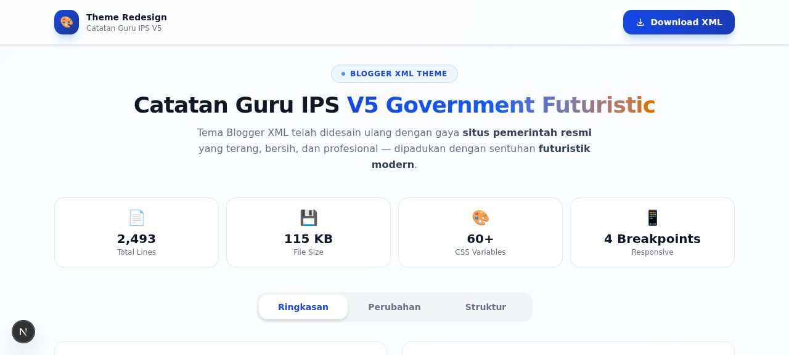

# 🎓 Catatan Guru IPS — Blogger XML Theme V5

**Catatan Guru IPS V5 Government-Futuristic Edition**

Tema Blogger XML yang telah di-redesign dengan gaya **governmental-institutional** yang modern dan futuristik. Warna cerah, bersih, profesional — terinspirasi dari situs resmi pemerintah dan dinas Indonesia.

---

## 📸 Preview

---

## ✨ Fitur Utama

- **Responsive Design** — Mobile-first, tampil sempurna di semua ukuran layar
- **Bright & Clean Color Scheme** — Navy blue primary, gold accent, white background
- **Futuristic UI** — Glassmorphism, gradient accents, clean geometric cards
- **Dark/Light Mode Toggle** — Otomatis tersimpan di localStorage
- **Reading Progress Bar** — Indikator progres baca di bagian atas
- **Smooth Scroll Animations** — IntersectionObserver-based reveal effects
- **Hero Section** — Landing area dengan featured cards
- **CPNS SKD Section** — Area khusus latihan SKD CPNS
- **Sponsor/Mitra Section** — Partnership showcase
- **Sidebar Widgets** — Popular Posts, Labels, Statistics
- **Search Overlay** — Pencarian dengan keyboard shortcut (Ctrl+K)
- **Back-to-Top Button** — Navigasi cepat ke atas
- **Mobile Navigation** — Hamburger menu dengan dropdown support
- **Copy Link Button** — Salin URL artikel dengan satu klik
- **SEO Optimized** — JSON-LD structured data, Open Graph, Twitter Cards
- **Font Awesome 6.5** — Ikon modern dan lengkap
- **Google Fonts** — Plus Jakarta Sans + Playfair Display

---

## 🎨 Palet Warna

| Elemen | Warna | Kode |
|--------|-------|------|
| Primary | Navy Blue | `#0C4A6E` |
| Primary Light | Sky Blue | `#0EA5E9` |
| Accent | Gold/Amber | `#D97706` |
| Background | White | `#FFFFFF` |
| Surface | Light Gray | `#F1F5F9` |
| Text Primary | Dark Slate | `#0F172A` |
| Text Secondary | Slate | `#475569` |
| Gradient | Blue → Teal | `#0C4A6E → #0D9488` |

---

## 📦 File

| File | Deskripsi |
|------|-----------|
| `catatanguruips-v5-government-futuristic.xml` | Template Blogger XML lengkap |
| `preview.png` | Screenshot preview tema |
| `README.md` | Dokumentasi ini |

---

## 🚀 Cara Install

1. Buka [Blogger Dashboard](https://www.blogger.com/) → **Theme** → **Edit HTML**
2. Hapus semua kode yang ada
3. **Copy** seluruh isi file `catatanguruips-v5-government-futuristic.xml`
4. **Paste** ke editor HTML Blogger
5. Klik **Save**
6. Selesai! ✅

---

## 📝 Catatan

- Semua tag Blogger XML (`b:if`, `b:loop`, `b:section`, `b:widget`, `b:includable`, `data:`, `expr:`) dipertahankan utuh
- Struktur dan fungsionalitas identik dengan versi asli
- Perubahan hanya pada CSS (warna, styling, layout visual)
- Kompatibel dengan Blogger Widget v2

---

## 👤 Author

**Catatan Guru IPS** — Portal edukasi IPS, Bank Soal, CPNS SKD, dan EdTech Tools

---

## 📄 Lisensi

Template ini bebas digunakan untuk keperluan pribadi dan edukasi. Silakan sesuaikan konten sesuai kebutuhan.
